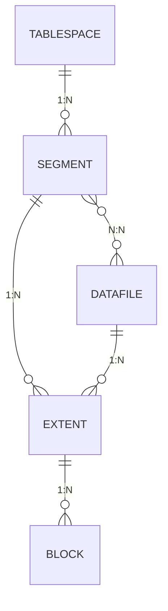

# 1장. SQL 처리과정과 I/O

## SQL 파싱과 최적화

### SQL 최적화

- SQL 파싱 과정
    - 파싱 트리 생성 : SQL문 이루는 개별 구성요소를 분석, 파싱 트리 생성
    - Syntax 체크 : 문법적 오류 확인
    - Semantic 체크 : 의미상 오류 확인
- SQL 최적화 - Optimizer
- 로우 소스 생성

### SQL 옵티마이저

- 옵티마이저의 최적화 단계
    - 사용자로부터 전달받은 쿼리를 수행하는데 후보군이 될만한 실행계획들을 찾아냄
    - 데이터 딕셔너리에 미리 수집해 둔 오브젝트 통계 및 시스템 통계정보를 이용해 각 실행계획의 예상비용을 산정
    - **최저 비용**을 나타내는 실행계획을 세움

### 실행계획과 비용

- 옵티마이저는 비용에 따라 인덱스를 선택 및 실행 계획 수립
    
    ```sql
    -- 테스트용 테이블 생성
    CREATE TABLE T AS
    SELECT D.NO, E.*
    FROM (
         SELECT * FROM EMPLOYEES
             JOIN DEPT_EMP USING (EMP_NO)
             JOIN DEPARTMENTS USING (DEPT_NO)
    ) E, (SELECT ROWNUM NO FROM DUAL CONNECT BY LEVEL <= 100) D;
    
    -- 3316만 건
    SELECT COUNT(*) FROM T;
    
    -- 인덱스 생성
    CREATE INDEX T_X01 ON T(DEPT_NO, NO);
    CREATE INDEX T_X02 ON T(DEPT_NO, FIRST_NAME, LAST_NAME, NO);
    ```
    
    ```sql
    SELECT * FROM T
    WHERE DEPT_NO = 'd005'
    AND NO = 1;
    ```
    
    ```
    ---------------------------------------------------------------------------------------------
    | Id  | Operation                           | Name  | Rows  | Bytes | Cost (%CPU)| Time     |
    ---------------------------------------------------------------------------------------------
    |   0 | SELECT STATEMENT                    |       | 36845 |  2266K|  3260   (1)| 00:00:01 |
    |   1 |  TABLE ACCESS BY INDEX ROWID BATCHED| T     | 36845 |  2266K|  3260   (1)| 00:00:01 |
    |*  2 |   INDEX RANGE SCAN                  | T_X01 | 36845 |       |   100   (0)| 00:00:01 |
    ---------------------------------------------------------------------------------------------
    ```
    
    ```sql
    SELECT /*+ INDEX(T T_X02) */ * FROM T
    WHERE DEPT_NO = 'd005'
    AND NO = 1;
    ```
    
    ```
    ---------------------------------------------------------------------------------------------
    | Id  | Operation                           | Name  | Rows  | Bytes | Cost (%CPU)| Time     |
    ---------------------------------------------------------------------------------------------
    |   0 | SELECT STATEMENT                    |       | 36845 |  2266K| 54548   (1)| 00:00:03 |
    |   1 |  TABLE ACCESS BY INDEX ROWID BATCHED| T     | 36845 |  2266K| 54548   (1)| 00:00:03 |
    |*  2 |   INDEX RANGE SCAN                  | T_X02 | 36845 |       | 17699   (1)| 00:00:01 |
    ---------------------------------------------------------------------------------------------
    ```
    
    ```sql
    SELECT /*+ FULL(T) */ * FROM T
    WHERE DEPT_NO = 'd005'
    AND NO = 1;
    ```
    
    ```
    --------------------------------------------------------------------------
    | Id  | Operation         | Name | Rows  | Bytes | Cost (%CPU)| Time     |
    --------------------------------------------------------------------------
    |   0 | SELECT STATEMENT  |      | 36845 |  2266K| 86009   (1)| 00:00:04 |
    |*  1 |  TABLE ACCESS FULL| T    | 36845 |  2266K| 86009   (1)| 00:00:04 |
    --------------------------------------------------------------------------
    ```
    
- 개발자가 직접 데이터 엑세스 경로를 변경 가능 → **옵티마이저 힌트**
- cost는 예상치이기에 실제 시간과는 차이 존재

### 옵티마이저 힌트

- 사용법
    
    ```sql
    SELECT /*+ INDEX(A 고객_PK) */
    			고객명, 연락처, 주소, 가입일시
    FROM 고객 A
    WHERE 고객ID = '1111'
    ```
    
- 주의 사항
    
    ```sql
    -- 콤마 사용은 인자에서만 가능
    /*+ INDEX(A A_X01 INDEX(B,B_X03) */ -- 모두 유효
    /*+ INDEX(C), FULL(D) */ -- 첫 번째 힌트만 유효
    
    -- 테이블을 지정시 스키마 명 명시 금지
    SELECT /*+ FULL(PUBLIC.EMP) */ -- 무효
    FROM EMP
    
    -- FROM 에서 ALIAS 지정시 힌트에도 ALIAS 사용
    SELECT /*+ FULL(EMP) */ -- 무효
    FROM EMP E
    ```
    

### 자주 사용하는 힌트 목록

| 분류 | 힌트 | 설명 |
| --- | --- | --- |
| 최적화 목표 | ALL_ROWS | 전체 처리 속도 최적화 |
|  | FIRST_ROWS | 최초 N건 응답 속도 최적화 |
| 액세스 방식 | FULL | Table Full Scan으로 유도 |
|  | INDEX | Index San으로 유도 |
|  | INDEX_DESC | Index를 역순으로 스캔하도록 유도 |
|  | INDEX_FFS | Index Fast Full Scan으로 유도 |
|  | INDEX_SS | Index Skip Scan으로 유도 |
| 조인 순서 | ORDERED | FROM 절에 나열된 순서대로 조인 |
|  | LEADING | LEADING 힌트 괄호에 기술한 순서대로 조인 |
|  | SWAP_JOIN_INPUTS | 해시 조인 시, BUILD INPUT을 명시적으로 선택 |
| 조인 방식 | USE_NL | NL 조인으로 유도 |
|  | USE_MERGE | 소트 머지 조인으로 유도 |
|  | USE_HASH | 해시 조인으로 유도 |
|  | NL_SJ | NL 세미조인으로 유도 |
|  | MERGE_SJ | 소트 머지 세미조인으로 유도 |
|  | HASH_SJ | 해시 세미조인으로 유도 |
| 서브쿼리 팩토링 | MATERIALIZE | WITH 문으로 정의한 집합을 물리적으로 생성하도록 유도 |
|  | INLINE | WITH 문으로 정의한 집합을 물리적으로 생성하지 않고 INLINE 처리하도록 유도 |
| 쿼리 변환 | MERGE | 뷰 머징 유도 |
|  | NO_MERGE | 뷰 머징 방지 |
|  | UNNEST | 서브쿼리 Unnesting 유도 |
|  | NO_UNNEST | 서브쿼리 Unnesting 방지 |
|  | PUSH_PRED | 조인조건 Pushdown 유도 |
|  | NO_PUSH_PRED | 조인조건 Pushdown 방지 |
|  | USE_CONCAT | OR 또는 IN-List 조건을 OR-Expansion으로 유도 |
|  | NO_EXPAND | OR 또는 IN-List 조건에 대한 OR-Expansion 방지 |
| 병렬 처리 | PARALLEL | 테이블 스캔 또는 DML을 병렬방식으로 처리하도록 유도 |
|  | PARALLEL_INDEX | 인덱스 스캔을 병렬방식으로 처리하도록 유도 |
|  | PQ_DISTRIBUTE | 병렬 수행 시 데이터 분배 방식 결정 |
| 기타 | APPEND | Direct-Path Insert 로 유도 |
|  | DRIVING_SITE | DB Link Remote 쿼리에 대한 최적화 및 실행 주체 지정 |
|  | PUSH_SUBQ | 서브쿼리를 가급적 빨리 필터링하도록 유도 |
|  | NO_PUSH_SUBQ | 서브쿼리를 가급적 늦게 필터링하도록 유도 |

## SQL 공유 및 재사용

### 소프트 파싱 vs 하드 파싱

- `라이브러리 캐시` : SQL 파싱, 최적화, 로우 소스 생성 과정을 거쳐 생성한 내부 프로시저를 반복 재사용할 수 있도록 캐싱해두는 메모리 공간
- `SGA(System Global Area)` : 서버 프로세스와 백그라운드 프로세스가 공통으로 액세스하는 데이터와 제어 구조를 캐싱하는 메모리 공간
- `소프트 파싱` : SQL을 캐시에서 찾아 곧바로 실행 단계에서 넘어가는 것
- `하드 파싱` : SQL을 캐시에서 찾는데 실패해 최적화 및 로우 소스 생성까지 거치는 것
    
    ```mermaid
    flowchart TD
        A@{ shape: circle, label: "사용자" } --> B[SQL 파싱]
        B --> C{캐시에 존재?}
        C -- Y --> D[실행]
        C -- N --> E[최적화]
        E --> F[로우 소스 생성]
        F --> D[실행]
    
    ```
    
- 하나의 쿼리를 수행하는데 있어 후보군이 될만한 무수히 많은 실행경로를 도출하고, 짧은 순간에 딕셔너리와 통계정보를 읽어 각각에 대한 효율성을 판단하는 과정은 무거움
    - DB의 대부분의 작업은 I/O, but 하드 파싱은 CPU를 소비
    - 옵티마이저가 사용하는 정보들
        - 테이블, 컬럼, 인덱스 구조에 관한 기본 정보
        - 오브젝트 통계 : 테이블 통계, 인덱스 통계, 컬럼 통계
        - 시스템 통계 : CPU 속도, Single Block I/O 속도, Multiblock I/O 속도 등
        - 옵티마이저 관련 파라미터
    - 캐시로 저장해서 하드 파싱 횟수를 줄이기

### 바인드 변수의 중요성

- 라이브러리 캐시에서 SQL을 찾는 법 - **SQL 문 그 자체**
    - SQL 텍스트가 변하면 SQL ID도 변함
    - 개발 과정 중에는 수시로 SQL이 바뀜 - 계속 적재되면 캐시에서 찾는게 느려짐
- 로그인 ID를 받는 로그인을 생각
    - 아래와 같이 로그인ID를 파라미터로 받는 프로시저 하나 공유 → 바인드 변수
        
        ```sql
        CREATE PROCEDURE LOGIN (login_id in varchar2) { ... }
        
        -- 라이브러리 캐시 : 하드 파싱 최초 1회만 발생
        SELECT * FROM CUSTOMER WHERE LOGIN_ID = :1
        ```
        

## 데이터 저장 구조 및 I/O 메커니즘

### SQL이 느린 이유

- 프로세스는 디스크 I/O를 요청할 시에 CPU를 OS에 반환하고 잠시 waiting 상태에서 I/O가 완료될 때까지 대기 진행 → 대기 큐에서 머물러 있음 → 작동해야 될 프로세스가 가만히 대기 → 성능 저하
- 프로세스 생명 주기
    
    ```mermaid
    stateDiagram-v2
        [*] --> new : 프로세스 생성
        
        new --> ready : admitted
        ready --> running : dispatched
        running --> ready : interrupted
        running --> waiting : I/O 완료 또는<br/>이벤트 완료
        waiting --> ready : I/O 요청 또는<br/>이벤트 대기
        running --> terminated : exit
        terminated --> [*]
        
        %% note right of new : 새로운 프로세스
        %% note right of ready : 실행 준비 상태
        %% note right of running : CPU 사용 중
        %% note right of waiting : I/O 대기 상태
        %% note right of terminated : 프로세스 종료
    ```
    

### 데이터베이스 저장 구조

> 테이블스페이스 → 세그먼트 → 익스텐트 → 블록 → 로우
> 
- `테이블스페이스` : 세그먼트를 담는 컨테이너
- `세그먼트` : 테이블, 인덱스, 파티션, LOB(Large Object) 같이 저장 공간이 필요한 영역
    - 세그먼트의 공간이 부족해지면 익스텐트를 추가로 할당 받음
    - 하지만 할당된 모든 익스텐트가 같은 데이터 파일에 위치하지 않을 수도 있음 - 분산 저장
    - `DBA_EXTENTS` 뷰에서 세그먼트에 할당된 익스텐트 목록 조회 가능
- `익스텐트` : 공간을 확장하는 단위, 여러 블록들로 구성
- `블록` : 레코드를 실제로 저장하는 공간, 페이지라고도 불림
    - 한 블록은 하나의 테이블이 독점 → 한 블록에 저장된 레코드는 모두 같은 테이블 레코드
    - `DBA(Data Block Address)` : 디스크 상에서 몇 번째 블록인지 나타냄
    - 테이블 스캔 시 : 익스텐트 맵 활용 → 첫 번째 블록 DBA → 블록은 연속이므로 Scan 가능
- `데이터파일` : 디스크 상의 물리적인 OS 파일

> 익스텐트 내 블록은 서로 인접, 익스텐트 끼리는 불연속!
> 
- `DBA(Data Block Address)` : 블록의 고유 주소값
    - 인덱스를 이용해 레코드를 읽을 때는 `ROWID` (`DBA` + 로우 번호)로 조회
    - 테이블 스캔 시에는 세그먼트 헤더에 저장된 익스텐트 맵 이용 → 첫번째 `DBA` 파악



### 블록 단위 I/O

> DBMS에서 데이터를 읽고 쓰는 단위
> 
- `V$PARAMETER` 조회

```bash
SQL> show parameter block_size

NAME                                 TYPE        VALUE
------------------------------------ ----------- ------------------------------
db_block_size                        integer     8192

SQL> select value from v$parameter where name='db_block_size';

VALUE
--------------------------------------------------------------------------------
8192
```

### 시퀀셜 액세스 vs 랜덤 액세스

- `시퀀셜` : 연결된 순서에 따라서
    - 하지만 테이블 블록간 논리적인 연결고리는 없음
        - 익스텐트 목록을 세그먼트 헤더에 **map**으로 관리
        - 익스텐트 맵 활용 → 첫 번째 블록 DBA → 블록은 연속이므로 Scan 가능
- `랜덤` : 순서X, 한 블록씩 접근

### 논리적 I/O vs 물리적 I/O

- `논리적` : SQL을 처리하는 과정에 발생한 총 블록 I/O (캐시를 모두 거침 - 사실상 메모리 I/O)
- `물리적` : 디스크에서 발생항 총 블록 I/O → 시간 오래 걸림

### 버퍼캐시 히트율(Buffer Cache Hit Ratio, BCHR)

```
BCHR = (캐시에서 곧바로 찾은 블록 수 / 촌 읽은 블록 수) * 100
	= ((논리적 I/O - 물리적 I/O) / (논리적 I/O)) * 100
	= (1 - (물리적 I/O) / (논리적 I/O)) * 100
```

```
물리적 I/O = 논리적 I/O * (100% - BCHR)
```

- 논리적 I/O 줄이기 - **SQL을 튜닝해서 읽는 총 블록 개수 줄이기**

### Single Block I/O vs Multiblock I/O

- 한번에 한 블록씩 요청해서 메모리 적재 → Single Block I/O
    - 인덱스를 이용할 시 인덱스와 테이블 블록 모두 Single Block I/O
        - 인덱스 루트 블록을 읽을 때
        - 인덱스 루트 블록에서 얻은 주소 정보로 브랜치 블록을 읽을 때
        - 인덱스 브랜치 블록에서 얻은 주소 정보로 리프 블록을 읽을 때
        - 인덱스 리프 블록에서 얻은 주소 정보로 테이블 블록을 읽을 때
- 한번에 여러 블록씩 요청해서 메모리 적재 → Multiblock I/O
    - 많은 데이터 블록을 읽을 때 유리 → 테이블 풀 스캔
    - OS 레벨 I/O 단위 : 1 MB, 오라클 레벨 I/O 단위 : 8 KB
    - 확인 - `db_file_multiblock_read_count` 파라미터
- Multiblock I/O 중간에 Single Block I/O 가 나타나는 이유
    - 익스텐트 맵은 테이블 블록에 대한 인덱스
    - Multiblock I/O는 Batch I/O
    - Full Scan 중 Chain 이 발생할 로루를 읽을 때

### Table Full Scan vs Index Range Scan

- 테이블 전체 스캔 vs 인덱스로 일정량만 스캔
- Table Full Scan
    - 시퀀셜 액세스 & Multi Block I/O 방식으로 디스크 블록 읽음
    - 소량의 데이터만 가져올 때는 불리, 가져오는 데이터의 사이즈가 클 경우 유리
- Index Range Scan
    - 랜덤 액세스 & Single Block I/O
    - 소량의 데이터만 가져올 때는 유리, 가져오는 데이터의 사이즈가 클 경우 불리

### 캐시 탐색 메커니즘

- Direct Path I/O를 제외한 모든 블록 I/O는 메모리 버퍼 캐시를 경유
    - 인덱스 루트 블록을 읽을 때
    - 인덱스 루트 블록에서 얻은 주소 정보로 브랜치 블록을 읽을 때
    - 인덱스 브랜치 블록에서 얻은 주소 정보로 리프 블록을 읽을 때
    - 인덱스 리프 블록에서 얻은 주소 정보로 테이블 블록을 읽을 때
    - 테이블 블록을 Full Scan 할 때
- 해시 체이닝을 통한 해시 구조 관리
- 가급적 SQL 튜닝을 통해 쿼리 일량(논리적 I/O) 자체를 줄여야 함
