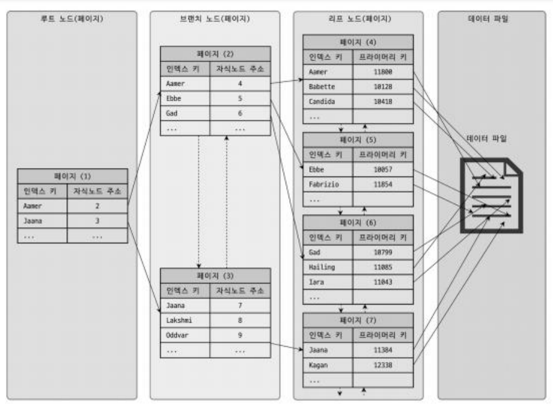

# 인덱스

> 데이터베이스 테이블의 칼럼 값과 레코드가 저장된 주소를 key-value 쌍으로 삼아 만들어둔 색인

- DBMS의 인덱스 역시 칼럼 값을 주어진 순서대로 미리 정렬해서 보관 (정렬된 상태 유지)
- 정렬을 해야하기 때문에 데이터의 저장 (Insert, Update, Delete) 성능은 떨어짐
- 정렬했기 때문에 읽기 속도는 높아짐
- 칼럼에 전부 인덱스를 생성할 경우 데이터 저장 성능은 떨어지고 인덱스 크기는 비대해져 비효율적

## B-Tree 인덱스

- 균형을 유지하면서 효율적인 검색, 삽입, 삭제 연산을 지원
- B-Tree 인덱스의 리프 노드는 항상 실제 데이터 레코드를 찾아가기 위한 주솟값을 가짐(랜덤 액세스를 통해 실제 데이터에 접근)

- 모든 리프 노드는 동일한 레벨에 위치, 시간 복잡도 `O(log N)`
- 삽입이나 삭제 시 노드가 가득 차거나 비어있을 경우 노드 분할(Split) 또는 노드 병합(Merge) 과정을 통해 균형을 유지

### B-Tree 인덱스의 추가, 삭제, 변경, 조회

1. 키 추가 (INSERT) 
- 데이터베이스에 새로운 행이 삽입되면, 해당 행의 인덱스 키도 함께 추가
- B-Tree 인덱스를 사용 중이라면, 새로운 키는 적절한 리프 노드에 삽입
- 리프 노드에 여유 공간이 있다면 키는 바로 추가되지만, 노드가 가득 찼을 경우에는 노드 분할(Split)이 발생해 균형을 유지
- 해당 작업은 디스크 I/O를 동반하기 때문에 과도한 삽입 작업은 성능에 영향을 줄 수 있음

2. 키 삭제 (DELETE) 
- 행이 삭제되면 해당 행의 인덱스 키도 삭제, 하지만 실제로는 즉시 삭제되지 않고 '마커'로 표시
- 나중에 최적화 작업(rebuild, reorganize) 중에 실제로 삭제가 완료
- 삭제로 인해 노드가 너무 비게 되면, 노드 병합(Merge)이 발생해 균형을 유지

3. 키 변경 (UPDATE) 
- DELETE + INSERT가 연속으로 발생하는 것과 동일

4. 키 조회 (SELECT)
- 주로 WHERE, JOIN, ORDER BY, GROUP BY 등의 연산에서 발생
- 루트 노드에서 시작해 리프 노드까지 키를 탐색(수직적 탐색).
- 수직적 탐색 이후 해당하는 범위를 조회합니다(수평적 탐색).

### B-Tree 인덱스 사용에 영향을 미치는 요소

1. 인덱스 키 값의 크기
- 키 값이 커지면 디스크 I/O 증가
  - 트리의 깊이가 증가
  - 더 많은 디스크 공간 필요
  - 메모리 및 캐시 효율성에도 영향

2. B-Tree의 깊이
- 깊이가 깊을 수록 디스크 I/O 증가
- 키 값이 커지면 깊이도 증가

3. 선택도(기수성)
- 인덱스 칼럼의 유니크한 값의 수
- 선택도가 높을수록(중복이 적을수록) 검색 효율성 증가

4. 읽어야 하는 레코드 건수
- 인덱스를 통해 읽어야 할 레코드가 20%를 넘어가게 되면(손익분기점) Table Full Scan이 유리할 수 있음