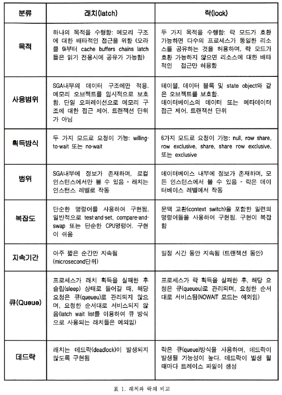

# 인덱스 튜닝

## 테이블 액세스 최소화

### ROWID

```sql
SELECT * FROM EMP WHERE EMP_NO = 20000;
```
```
--------------------------------------------------------------------------------------
|   0 | SELECT STATEMENT            |        |     1 |    48 |     2   (0)| 00:00:01 |
|   1 |  TABLE ACCESS BY INDEX ROWID| EMP    |     1 |    48 |     2   (0)| 00:00:01 |
|*  2 |   INDEX UNIQUE SCAN         | PK_EMP |     1 |       |     1   (0)| 00:00:01 |
--------------------------------------------------------------------------------------
```
인덱스 스캔을 진행 시 테이블 Random 액세스가 발생합니다(`TABLE ACCESS BY INDEX ROWID`).

이 때 ROWID는 물리적 위치 정보로 구성이 되지만, 테이블 레코드로 직접 연결되는 구조는 아닙니다.

#### 메인 메모리(인 메모리) DB 와의 비교

Redis 와 같은 메모리로만 이루어진 DB(IMDB/MMDB)와 RDB와의 차이점은 흔히 Disk I/O의 유무로 속도가 Redis가 더 빠른 것으로 알려져 있습니다. 하지만 튜닝을 잘 해놓으면 버퍼 캐시 히트율(BCHR)이 99% 이상이기에 대부분 메모리 상에서 작업을 수행합니다. 하지만 우리는 MMDB가 더 빠른 걸 이미 알고 있습니다. 왜 그럴까요?

MMDB의 경우는 인덱스를 생성할 때 메모리 상의 주소 정보(포인터)를 갖습니다. 하지만 오라클은 Disk 주소 정보를 가지게 됩니다. 오라클은 테이블 블록이 버퍼캐시에 있다가 없다가를 반복하기에 인덱스에서 포인터를 사용해서 직접 블록을 연결하지 못하는 구조입니다. 즉 디스크 주소 정보(DBA)를 통해서 해시 알고리즘으로 버퍼 블록을 찾아갑니다.

#### ROWID에 의한 테이블 액세스

> 결론 : ROWID를 이용한 테이블 액세스는 고비용

아래 내용은 **오라클 성능 고도화 원리와 해법**에서 인용하였습니다.
<details>
  <summary>테이블 블록 찾는 과정</summary>

- 인덱스에서 ROWID를 읽고 DBA를 해시 함수에 적용해 해시 값 확인
- 해시 값이 가리키는 해시 체인에 대한 래치를 얻으려고 시도
- 다른 프로세스가 래치를 잡고 있으면 래치가 풀렸는지 확인하는 작업 일정 횟수만큼 반복
    - 실패시 대기 상태(latch free 대기 이벤트)
    - sleep 후 다시 latch 상태 확인
    - 해제되면 래치 획득
- 래치 획득 후 해시 체인 진입
- 앞선 프로세스가 버퍼 Lock을 쥔 상태면 대기 상태(buffer busy waits), 읽기를 마치면 Lock 해제 필요

</details>

<details>
  <summary>테이블 블록 못 찾은 경우</summary>

- 우선 Free Buffer를 할당 받아야 하기에 LRU 리스트부터 확인
    - cache buffers lru chain 래치 필요
    - 못찾으면 Dirty Buffer들을 disk에 기록하는 DBWR(Database Writer)에 Free Buffer 확보 신호(free buffer waits)
- 할당 받으면 I/O 요청 후 대기(db file sequential read 대기 이벤트)
- LRU update가 필요하므로 다시 cache buffers lru chain 래치 필요

</details>

<details>
  <summary>latch vs lock</summary>



</details>

### 인덱스 클러스터링 팩터(Clustering Factor, CF)

> - 군집성 계수, 특정 컬럼 기준으로 같은 값을 갖는 데이터가 서로 모여 있는 정도
> - 인덱스를 경유해 테이블 전체 로우를 액세스 할 때 읽을 것으로 예상되는 논리적 블록 개수

```sql
CREATE INDEX FIRST_NAME_IDX ON EMP(FIRST_NAME);
CREATE INDEX DEPT_NO_IDX ON EMP(DEPT_NO);

EXEC DBMS_STATS.GATHER_DATABASE_STATS('DOCKER', 'EMP');

SELECT I.INDEX_NAME, T.BLOCKS TABLE_BLOCKS, I.NUM_ROWS, I.CLUSTERING_FACTOR
FROM USER_TABLES T, USER_INDEXES I
WHERE T.TABLE_NAME = 'EMP'
AND I.TABLE_NAME = T.TABLE_NAME;
```

| INDEX\_NAME | TABLE\_BLOCKS | NUM\_ROWS | CLUSTERING\_FACTOR |
| :--- | :--- | :--- | :--- |
| PK\_EMP | 2294 | 300024 | 299862 |
| FIRST\_NAME\_IDX | 2294 | 300024 | 284877 |
| DEPT\_NO\_IDX | 2294 | 300024 | 20240 |

- clustering_factor가 
    - table_blocks에 가까울수록 데이터가 잘 정렬됨을 의미
    - num_rows에 가까울수록 흩어져 있음을 의미
- 해당 값은 옵티마이저가 Full Scan과 비교했을 때 비용 평가 대상
- CF가 좋다 - 인덱스 정력 순서와 테이블 정렬 순서가 비슷하다 - 테이블 액세스량에 비해 블록 I/O가 적게 발생

### 인덱스 손익분기점

- Table Full Scan
    - 시퀀셜 액세스
    - Multi Block I/O
- Index ROWID
    - 랜덤 액세스
    - Single Block I/O
- 보통 5 ~ 20%에서
    - 이보다 작으면 Index 크면 Table Full Scan 유리

#### 온라인 프로그램 튜닝 vs 배치 프로그램 튜닝

- 온라인 프로그램 튜닝
    - 소량을 데이터를 읽고 갱신 - 인덱스 활용이 중요(NL 조인)
- 배치 프로그램 튜닝
    - 대량의 데이터를 읽고 갱신 - 전체범위를 빠르게 처리하는 것이 중요, Full Scan
    - Hash 조인이 유리
- 초대용량 테이블
    - 파티션 활용 전략이 중요

### 인덱스 컬럼 추가

```sql
SELECT *
FROM EMP
WHERE FIRST_NAME = 'Irene'
AND DEPT_NO = 'd005';
```
### 단일 컬럼 인덱스만 있을 때
```sql
CREATE INDEX DEPT_NO_IDX ON EMP(DEPT_NO);
```
```
--------------------------------------------------------------------------
| Id  | Operation         | Name | Rows  | Bytes | Cost (%CPU)| Time     |
--------------------------------------------------------------------------
|   0 | SELECT STATEMENT  |      |    43 |  2064 |   625   (1)| 00:00:01 |
|*  1 |  TABLE ACCESS FULL| EMP  |    43 |  2064 |   625   (1)| 00:00:01 |
--------------------------------------------------------------------------
```
- 결과: 여전히 Full Table Scan
- 원인: 두 조건을 모두 만족하는 결과가 43건으로 적지만, 옵티마이저가 단일 인덱스로는 비효율적이라고 판단

### 2단계: 복합 인덱스 생성
```sql
CREATE INDEX EMP_X01 ON EMP(DEPT_NO, FIRST_NAME);
```
```
-----------------------------------------------------------------------------------------------
| Id  | Operation                           | Name    | Rows  | Bytes | Cost (%CPU)| Time     |
-----------------------------------------------------------------------------------------------
|   0 | SELECT STATEMENT                    |         |    43 |  2064 |    46   (0)| 00:00:01 |
|   1 |  TABLE ACCESS BY INDEX ROWID BATCHED| EMP     |    43 |  2064 |    46   (0)| 00:00:01 |
|*  2 |   INDEX RANGE SCAN                  | EMP_X01 |    43 |       |     3   (0)| 00:00:01 |
-----------------------------------------------------------------------------------------------
```
- 결과: Index Range Scan 사용
- 성능 개선: Cost 625 → 46 (약 93% 개선)

### 인덱스 구조 테이블

#### IOT (Index-Organized Table)

IOT는 랜덤 액세스를 아예 발생시키지 않도록 테이블 자체를 인덱스 구조로 구성하는 방법입니다. 다른 RDBMS에서 **클러스터형 인덱스**라고 부르는 바로 그것입니다.

```sql
-- IOT로 테이블 생성
CREATE TABLE EMP_IOT (
    EMP_ID NUMBER PRIMARY KEY,
    NAME VARCHAR2(50),
    DEPT_NO VARCHAR2(10),
    SALARY NUMBER
) ORGANIZATION INDEX;

-- 일반 테이블 (보통 생략)
CREATE TABLE EMP_HEAP (
    EMP_ID NUMBER PRIMARY KEY,
    NAME VARCHAR2(50)
) ORGANIZATION HEAP;
```

**IOT의 장점**
- `TABLE ACCESS BY INDEX ROWID` 단계가 사라짐
- 클러스터링 팩터 문제 해결
- PRIMARY KEY 순서로 데이터가 정렬되어 저장

**IOT 사용 시기**
- PRIMARY KEY로 자주 조회하는 테이블
- 범위 검색이 많은 경우
- 테이블 크기가 상대적으로 작은 경우

#### 클러스터 테이블

**인덱스 클러스터 테이블**
```sql
-- 클러스터 생성
CREATE CLUSTER EMP_DEPT_CLUSTER (DEPT_NO VARCHAR2(10));
CREATE INDEX EMP_DEPT_CLUSTER_IDX ON CLUSTER EMP_DEPT_CLUSTER;

-- 클러스터에 테이블 생성
CREATE TABLE EMP (
    EMP_ID NUMBER,
    DEPT_NO VARCHAR2(10),
    NAME VARCHAR2(50)
) CLUSTER EMP_DEPT_CLUSTER (DEPT_NO);
```

**해시 클러스터 테이블**
```sql
CREATE CLUSTER EMP_HASH_CLUSTER (DEPT_NO VARCHAR2(10))
SIZE 8192 HASHKEYS 100;

CREATE TABLE EMP (
    EMP_ID NUMBER,
    DEPT_NO VARCHAR2(10)
) CLUSTER EMP_HASH_CLUSTER (DEPT_NO);
```

## 부분 범위 처리

DBMS는 대량의 데이터를 한 번에 전송하지 않고 일정량씩 나누어 전송합니다. 클라이언트가 추가 Fetch Call을 요청하기 전까지 서버는 정지 상태를 유지합니다.

### Array Size 최적화

```sql
-- Array Size 확인 (SQL*Plus)
SHOW ARRAYSIZE

-- Array Size 변경
SET ARRAYSIZE 1000
```

**Array Size 선택 기준**
- **대량 데이터가 필요한 경우**: Array Size를 늘려 Fetch Call 횟수 감소
- **앞쪽 일부만 필요한 경우**: 지나치게 큰 Array Size는 메모리 낭비

### 부분 범위 처리 활용 예시

```sql
-- 첫 10건만 빠르게 조회
SELECT * FROM EMP 
WHERE DEPT_NO = 'd005' 
ORDER BY EMP_ID
FETCH FIRST 10 ROWS ONLY;
```

부분 범위 처리가 효과적인 경우라면 인덱스를 통해 처음 10건을 찾자마자 결과를 반환할 수 있습니다.

## 인덱스 스캔 효율화

### 조건절 분류

**인덱스 액세스 조건**
- 인덱스의 스캔 범위를 결정하는 조건절
- 수직적 탐색에서 시작점을 결정

**인덱스 필터 조건**
- 인덱스 스캔 과정에서 테이블 액세스 여부를 결정
- 불필요한 테이블 액세스 제거

**테이블 필터 조건**
- 테이블 액세스 후 최종 결과집합 포함 여부 결정

### 옵티마이저 비용 계산

옵티마이저는 다음 비용들의 총합으로 실행계획을 평가합니다:

1. **수직적 탐색 비용**: 인덱스 루트와 브랜치 레벨에서 읽는 블록 수
2. **수평적 탐색 비용**: 인덱스 리프 블록 스캔 과정의 블록 수  
3. **테이블 랜덤 액세스 비용**: 테이블 액세스 과정의 블록 수

### 인덱스 스캔 최적화 기법

**BETWEEN을 IN-List로 전환**

```sql
-- 기존 (연속 범위 스캔)
WHERE ORDER_DATE BETWEEN '2024-01-01' AND '2024-12-31'

-- 개선 (불연속 범위 스캔)  
WHERE ORDER_DATE IN ('2024-01-01', '2024-02-01', '2024-03-01', ...)
```

**주의사항**: 데이터 분포를 반드시 고려해야 합니다. 특정 월에 데이터가 집중되어 있다면 오히려 비효율적일 수 있습니다.

**Index Skip Scan 활용**

```sql
-- 복합 인덱스: (DEPT_NO, EMP_ID)
-- DEPT_NO 조건 없이도 EMP_ID 조건만으로 인덱스 활용 가능
SELECT * FROM EMP WHERE EMP_ID = 1000;
```

첫 번째 컬럼을 생략해도 두 번째 컬럼의 선택도가 높다면 Skip Scan이 효과적입니다.

## 인덱스 설계 원칙

### 설계 순서

1. **조건절 분석**: 항상 사용하거나 자주 사용하는 컬럼 선정
2. **컬럼 순서 결정**: '=' 조건으로 자주 조회하는 컬럼을 앞쪽에 배치

### 실무 설계 예시

```sql
-- 자주 사용하는 쿼리 패턴 분석
SELECT * FROM EMP WHERE DEPT_NO = 'd005' AND STATUS = 'A';
SELECT * FROM EMP WHERE DEPT_NO = 'd005' AND HIRE_DATE >= '2024-01-01';
SELECT * FROM EMP WHERE DEPT_NO = 'd005';

-- 최적 인덱스 설계
CREATE INDEX EMP_OPTIMAL_IDX ON EMP(DEPT_NO, STATUS, HIRE_DATE);
```

**설계 근거**
- `DEPT_NO`: 모든 쿼리에서 사용하는 필수 조건
- `STATUS`: 등치(=) 조건으로 자주 사용
- `HIRE_DATE`: 범위 조건이므로 마지막에 배치

### 인덱스 설계 체크리스트

**필수 확인사항**
- WHERE 절에서 자주 사용하는 컬럼 포함 여부
- 등치 조건 컬럼을 범위 조건 컬럼보다 앞에 배치
- 선택도가 높은 컬럼의 우선 배치
- 불필요한 컬럼 제거로 인덱스 크기 최소화

#### 중복 인덱스 제거

1. 중복제거 실습 1
    - PK : 거래일자 + 관리지점번호 + 일련번호
    - N1 : 계좌번호 + 거래일자
    - N2 : 결제일자 + 관리지점번호
    - N3 : 거래일자 + 종목코드
    - N4 : 거래일자 + 계좌번호

    | 컬럼명 | Number of Distinct Value |
    |---|---|
    | 거래일자 | 2356 |
    | 관리지점번호 | 127 |
    | 일련번호 | 1850 |
    | 계좌번호 | 5956 |
    | 종목코드 | 1715 |
    | 결제일자 | 2356 |

2. 중복제거 실습 2
    - PK : 주소ID + 건물호번호 + 관리번호
    - N1 : 상태구분코드 + 관리번호
    - N2 : 관리번호
    - N3 : 주소ID + 관리번호

    | 컬럼명 | Number of Distinct Value |
    |---|---|
    | 주소ID | 2356 |
    | 건물동번호 | 175 |
    | 건물호번호 | 3052 |
    | 관리번호 | 250782 |
    | 상태구분코드 | 3 |