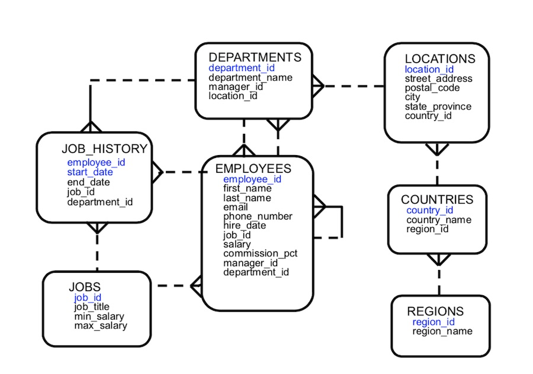

# NL 조인

- 중첩 for 문과 같은 원리 - 한쪽 테이블을 고정, 다른쪽 테이블에서 맞는 결과를 Scan
- Outer 와 Inner 테이블 양쪽 테이블의 인덱스를 모두 사용
    - `Outer`
        - 중첩 for 문에서 바깥쪽 for 문에 해당하는 테이블
        - 실행 계획상 **위쪽**에 존재하는 테이블
        - `Driving` (NL), `First` (소트 머지), `Build Input` (Hash)
        - 1 : M 관계의 테이블에서 소량(1쪽)의 테이블이 유리
    - `Inner`
        - 중첩 for 문에서 안쪽 for 문에 해당하는 테이블
        - 실행 계획상 **아래쪽**에 존재하는 테이블
        - `Driven` (NL), `Second` (소트 머지), `Probe Input` (Hash)
        - 1 : M 관계의 테이블에서 대량(M쪽)의 테이블이 유리

## NL 조인 실행계획 제어

- `NESTED LOOPS`
- `ordered` 힌트 : FROM 절에 기술한 순서대로 조인하라고 옵티마이저에 지시
    - `use_nl` 힌트 : NL 조인 지시
    - ex) A, B, C, D 조인 : `/*+ ordered use_nl(B) use_nl(C) use_nl(D) */`
- `leading` 힌트 : 순서 정할 수 있음
    - ex) A, B, C, D → C, A, D, B 순 : `/*+ leading(C, A, D, B) use_nl(A) use_nl(D) use_nl(B) */`
- `ordered` 나 `leading` 이 없다면 옵티마이저가 알아서 순서 정하기

## NL 조인 수행 과정 분석

- 인덱스
    
    ```
    PK_DEPT : DEPT.DEPTNO
    DEPT_LOC_IDX : DEPT.LOC
    PK_EMP : EMP.EMPNO
    EMP_DEPTNO_IDX : EMP.DEPTNO
    EMP_SAL_IDX : EMP.SAL
    ```
    
- 쿼리
    
    ```sql
    SELECT /*+ ORDERED USE_NL(E) */
    	E.EMPNO, E.ENAME, D.DNAME, E.JOB, E.SAL
    FROM DEPT D, EMP E
    WHERE E.DEPTNO = D.DEPTNO -- 1
    AND D.LOC = 'SEOUL' -- 2
    AND D.GB = '2' -- 3
    AND E.SAL >= 1500 -- 4
    ORDER BY SAL DESC
    ```
    
- 순서
    
    ```
    NESTED LOOPS
    	TABLE ACCESS BY INDEX ROWID DEPT
    		INDEX RANGE SCAN DEPT_LOC_IDX
    	TABLE ACCESS BY INDEX ROWID EMP
    		INDEX RANGE SCAN EMP_DEPTNO_IDX
    ```
    
    - `dept_loc_idx` 로 인덱스 범위 스캔
        - `dept.loc = 'SEOUL'` , `dept.gb = '2'` 필터 조건을 만족하는 레코드 찾기
    - 인덱스 rowid로 dept 테이블 엑세스
    - `emp_deptno_idx` 로 인덱스 범위 스캔
        - `emp.sal >= 1500` 필터 조건을 만족하는 레코드 찾기
    - 인덱스 rowid로 emp 테이블 엑세스
    - `sal` 기준 내림차순 정렬
- 튜닝 포인트
    - `dept_loc_idx` 를 통한 dept 테이블 엑세스
    - `emp_deptno_idx` 를 탐색
    - `emp_deptno_idx` 를 통한 emp 테이블 액세스

## NL 조인 특징

- 랜덤 액세스 위주의 조인 방식
- 조인을 한 레코드씩 순차적으로 진행
- 인덱스 구성 전략이 중요
- OLTP 시스템에 적합

## NL 조인 확장 메커니즘

- NL 조인 기본 실행계획
    
    ```
    NESTED LOOPS
    	TABLE ACCESS BY INDEX ROWID DEPT
    		INDEX RANGE SCAN DEPT_LOC_IDX
    	TABLE ACCESS BY INDEX ROWID EMP
    		INDEX RANGE SCAN EMP_DEPTNO_IDX
    ```
    
- **테이블 Prefetch**
    - Inner 테이블에 대한 디스크 I/O 과정에 테이블 Prefetch 기능이 작동
    - `nlj_prefetch` vs `no_nlj_prefetch`
    
    ```
    TABLE ACCESS BY INDEX ROWID OF EMP
    	NESTED LOOPS
    		TABLE ACCESS BY INDEX ROWID DEPT
    			INDEX RANGE SCAN DEPT_LOC_IDX
    		INDEX RANGE SCAN EMP_DEPTNO_IDX
    ```
    
    - 디스크 I/O가 필요해지면 이어서 곧 읽게 될 블록까지 미리 읽어 버퍼 캐시에 적재
    - 한번에 여러 개 Single Block I/O를 동시 수행
    - 서로 다른 익스텐트에 위치한 블록이라도 I/O Call 을 병렬 방식으로 동시에 여러 개 수행
- 배치 I/O
    - Inner 테이블에 대한 디스크 I/O 과정에 배치 I/O 기능이 작동
    - `nlj_batching` vs `no_nlj_batching`
    
    ```
    NESTED LOOPS
    	NESTED LOOPS
    		TABLE ACCESS BY INDEX ROWID DEPT
    			INDEX RANGE SCAN DEPT_LOC_IDX
    		INDEX RANGE SCAN EMP_DEPTNO_IDX
    	TABLE ACCESS BY INDEX ROWID EMP
    ```
    
    - 디스크 I/O Call 을 미뤘다 읽을 블록이 일정량 쌓이면 한꺼번에 처리
    - 데이터의 정렬 순서를 보장하지 않기에 `ORDER BY` 명시 필요
- 자가진단 Test
    - 아래와 같은 쿼리에서 `PRA_HST_STC` 테이블에 생성할 인덱스 `PRA_HST_STC_N1` 설계
        
        ```sql
        SELECT *
        FROM PRA_HST_STC A, ODM_TRMS B
        WHERE A.SALE_ORG_ID = :sale_org_id
        AND B.STRD_GRP_ID = A.STRD_GRP_ID
        AND B.STRD_ID = A.STRD_ID
        ORDER BY A.STC_DT DESC
        ```
        
    - 예시 답안
        
        ```
        PRA_HST_STC_N1 : SALE_ORG_ID + STC_DT
        ```
        

# 소트 머지 조인

- NL 조인인 대량 데이터 조인에 효과적이지 못함 → 소트 머지 조인, 해시 조인이 대안
- 소트 머지 조인은 주로 해시 조인을 사용하지 못할 경우 대량 데이터 조인할 때 유용
- **머지 소트**의 과정을 생각하면 쉬움

## SGA vs PGA

- `데이터베이스(Database)` : 디스크에 저장된 데이터 집합(Datafile, Redo Log File, Control File 등)
- `인스턴스(Instance)` : `SGA(System Global Area)` + 프로세스 집합
- 오라클 접속 시 리스너에게 연결 요청을 하는 순간 하나의 프로세스를 띄우고 `PGA(Private Global Area)` 를 할당 받음
- 독립적인 메모리 공간 - 래치 불필요, SGA 버퍼캐시에서 읽을 때보다 빠름

## 기본 메커니즘

- 소트 + 머지
- 쿼리 예시 : `use_merge` 힌트 사용
    
    ```sql
    SELECT /*+ ORDERED USE_MERGE(E) */
    	E.EMPNO, E.ENAME, D.DNAME, E.JOB, E.SAL
    FROM DEPT D, EMP E
    WHERE E.DEPTNO = D.DEPTNO
    AND D.LOC = 'SEOUL'
    AND D.GB = '2'
    AND E.SAL >= 1500
    ```
    
- 순서
    1. 아래 데이터를 읽어 조인 컬럼의 조건으로 정렬
        
        ```sql
        SELECT D.DNAME
        FROM DEPT D
        WHERE D.LOC = 'SEOUL'
        AND D.GB = '2'
        ORDER BY D.DEPTNO
        ```
        
    2. 아래 데이터를 읽어 조인 컬럼의 조건으로 정렬
        
        ```sql
        SELECT E.EMPNO, E.ENAME, E.JOB, E.SAL
        FROM EMP E
        WHERE E.SAL >= 1500
        ORDER BY E.DEPTNO
        ```
        
    3. 각 결과 집합은 PGA 영역에 할당된 Sort Area에 저장, 정렬한 결과 집합이 PGA에 담을 수 없을 정도로 크면 Temp 테이블 스페이스에 저장한다.
    4. Outer(DEPT) 데이터를 스캔하면서 Inner(EMP) 데이터와 조인합니다.

## 소트 머지 조인이 빠른 이유

- Inner 스캔시 매번 Full Scan 할 필요가 없음
- 소트 머지 조인은 조인 컬럼에 대한 인덱스의 영향을 받지 않음
- NL 조인은 엑세스 하는 모든 블록을 랜덤 액세스 방식으로 **건건이** DB 버퍼캐시를 경유해서 읽지만, 소트 머지 조인은 각각의 결과 집한을 **일괄적으로** 읽어 PGA에 저장한 후 조인
    - PGA는 독립적인 메모리 공간 - 래치 불필요, SGA 버퍼캐시에서 읽을 때보다 빠름
    - 조인 대상 집합 자체를 찾을 때는 DB 버퍼캐시를 사용

## 소트 머지 조인의 주용도

- 해시 조인은 조인 조건식이 등치일 때만 사용 가능
    - 조인 조건식이 등치 조건이 아닌 대량 데이터 조인
    - 조인 조건식이 아예 없는 조인(Cross Join)

## 소트 머지 조인 제어하기

- 기본 실행 계획
    
    ```
    MERGE JOIN
    	SORT (JOIN)
    		TABLE ACCESS BY INDEX ROWID DEPT
    			INDEX RANGE SCAN DEPT_LOC_IDX
    	SORT (JOIN)
    		TABLE ACCESS BY INDEX ROWID EMP
    			INDEX RANGE SCAN EMP_DEPTNO_IDX
    ```
    

# 해시 조인

- 소트 조인은 양쪽 테이블을 모두 정렬해야 됨, but 해시 조인은 그럴 필요가 없음

## 기본 메커니즘

- Build 단계 : Build Input을 읽어 해시 테이블(해시 맵)을 생성 → 작은 쪽이 Outer
- Probe 단계 : Probe Input을 읽어 해시 테이블을 탐색하면서 조인 → 큰 쪽이 Inner
- 쿼리 : `use_hash` 힌트 사용
    
    ```sql
    SELECT /*+ ORDERED USE_HASH(E) */
    	E.EMPNO, E.ENAME, D.DNAME, E.JOB, E.SAL
    FROM DEPT D, EMP E
    WHERE E.DEPTNO = D.DEPTNO
    AND D.LOC = 'SEOUL'
    AND D.GB = '2'
    AND E.SAL >= 1500
    ```
    
    1. Build 단계 : 작은 집합을 옵티마이저가 선택하여 해당 집합에 대한 해시 테이블을 생성한다.
        - 해시 테이블은 PGA 영역에 할당된 Hash Area에 저장, 너무 크면 Temp 테이블 스페이스에 저장
        
        ```sql
        SELECT D.DNAME
        FROM DEPT D
        WHERE D.LOC = 'SEOUL'
        AND D.GB = '2'
        ```
        
    2. Probe 단계 : 조건에 맞는 Inner 데이터를 하나씩 읽어 생성한 해시 테이블을 탐색, 해시 함수에 입력해서 반환된 값으로 해시 체인을 찾고, 그 해시 체인을 스캔해서 값이 같은 데이터를 찾음
        
        ```sql
        SELECT E.EMPNO, E.ENAME, E.JOB, E.SAL
        FROM EMP E
        WHERE E.SAL >= 1500
        ```
        

## 해시 조인이 빠른 이유

- NL 조인은 랜덤 엑세스 기반 부하 발생
- 소트 머지 조인은 양쪽 모두 정렬하는 정렬 부하 발생
- 해시 조인
    - 기본적으로 PGA 영역 → 독립적인 메모리 공간 → 래치 불필요, SGA 버퍼캐시에서 읽을 때보다 빠름
    - 둘 중 작은 집합 하나만 해시 테이블로 만드는 작업 수행

## 대용량 Build Input 처리

대용량 테이블은 인메모리 해시 조인은 불가능 → 분할 정복 방식으로 해결

- 파티션 단계
    - 양쪽 집합의 조인 컬럼에 해시 함수를 적용
    - 반환된 해시 값에 따라 동적으로 파티셔닝 → 독립적으로 서브 집합 → pair 생성
    - 디스크 공간(Temp 공간)에 저장하기에 인메모리 해시 조인보다 성능이 나쁨
- 조인 단계
    - 각 pair 에 대해서 하나씩 조인 수행
    - Build Input & Probe Input은 독립적으로 결정 - 집합 크기에 따른 옵티마이저의 선정

## 해시 조인 실행계획 제어

- 기본 실행 계획
    
    ```
    HASH JOIN
    	TABLE ACCESS BY INDEX ROWID DEPT
    		INDEX RANGE SCAN DEPT_LOC_IDX
    	TABLE ACCESS BY INDEX ROWID EMP
    		INDEX RANGE SCAN EMP_DEPTNO_IDX
    ```
    
- 일반적으로 카디널리티가 작은 테이블 선정
- 사용자가 직접 Build Input 선택하기
    - `leading` & `ordered` - 지시한 순서에 따라 가장 먼저 읽는 테이블을 Build Input 선택
    - `swap_join_inputs` - Build Input 명시적으로 선택

### 조인 알고리즘

다음과 같은 쿼리를 살펴보자.



```sql
SELECT /*+ LEADING(R, C, L, D, E)
    USE_HASH(C) USE_HASH(L) USE_HASH(D) USE_HASH(E) */
    E.FIRST_NAME, E.LAST_NAME, D.DEPARTMENT_NAME
    , L.STREET_ADDRESS, L.CITY, C.COUNTRY_NAME, R.REGION_NAME
FROM REGIONS R, COUNTRIES C, LOCATIONS L, DEPARTMENTS D, EMPLOYEES E
WHERE D.DEPARTMENT_ID = E.DEPARTMENT_ID
AND L.LOCATION_ID = D.LOCATION_ID
AND C.COUNTRY_ID = L.COUNTRY_ID
AND R.REGION_ID = C.REGION_ID
```

```
---------------------------------------------------------------------------------------------
| Id  | Operation               | Name              | Rows  | Bytes | Cost (%CPU)| Time     |
---------------------------------------------------------------------------------------------
|   0 | SELECT STATEMENT        |                   |   106 | 10388 |    12   (0)| 00:00:01 |
|*  1 |  HASH JOIN              |                   |   106 | 10388 |    12   (0)| 00:00:01 |
|*  2 |   HASH JOIN             |                   |    27 |  2187 |    10   (0)| 00:00:01 |
|*  3 |    HASH JOIN            |                   |    23 |  1426 |     7   (0)| 00:00:01 |
|*  4 |     HASH JOIN           |                   |    25 |   650 |     4   (0)| 00:00:01 |
|   5 |      TABLE ACCESS FULL  | REGIONS           |     5 |    50 |     3   (0)| 00:00:01 |
|   6 |      INDEX FULL SCAN    | COUNTRY_C_ID_PK   |    25 |   400 |     1   (0)| 00:00:01 |
|   7 |     TABLE ACCESS FULL   | LOCATIONS         |    23 |   828 |     3   (0)| 00:00:01 |
|   8 |    TABLE ACCESS FULL    | DEPARTMENTS       |    27 |   513 |     3   (0)| 00:00:01 |
|   9 |   VIEW                  | index$_join$_005  |   107 |  1819 |     2   (0)| 00:00:01 |
|* 10 |    HASH JOIN            |                   |       |       |            |          |
|  11 |     INDEX FAST FULL SCAN| EMP_DEPARTMENT_IX |   107 |  1819 |     1   (0)| 00:00:01 |
|  12 |     INDEX FAST FULL SCAN| EMP_NAME_IX       |   107 |  1819 |     1   (0)| 00:00:01 |
---------------------------------------------------------------------------------------------
 
Predicate Information (identified by operation id):
---------------------------------------------------
 
   1 - access(""D"".""DEPARTMENT_ID""=""E"".""DEPARTMENT_ID"")
   2 - access(""L"".""LOCATION_ID""=""D"".""LOCATION_ID"")
   3 - access(""C"".""COUNTRY_ID""=""L"".""COUNTRY_ID"")
   4 - access(""R"".""REGION_ID""=""C"".""REGION_ID"")
  10 - access(ROWID=ROWID)
```

- id 4번 : `region` 을 해시 테이블로 빌드하고, `countries` 를 읽어 해시 테이블을 탐색하면서 조인 수행
- id 3번 : `region` , `countries` 조인 결과를 해시 테이블로 빌드하고, `locations` 를 읽어 해시 테이블을 탐색하면서 조인 수행
- id 2번 : `region` , `countries` , `locations` 조인 결과를 해시 테이블로 빌드하고, `departments` 를 읽어 해시 테이블을 탐색하면서 조인 수행
- id 1번 : `region` , `countries` , `locations` , `departments` 조인 결과를 해시 테이블로 빌드하고, `employees` 를 읽어 해시 테이블을 탐색하면서 조인 수행
- 조인 순서는 `ordered` 또는 `leading` 힌트로 결정하지만 Build Input은 옵티마이저에 의해 자유롭게 결정 → Build Input 까지 조정하려면 `swap_join_inputs` 힌트를 사용

```sql
SELECT /*+ LEADING(R, C, L, D, E)
    USE_HASH(C) USE_HASH(L) USE_HASH(D) USE_HASH(E) 
    SWAP_JOIN_INPUTS(L)
    SWAP_JOIN_INPUTS(D)
    SWAP_JOIN_INPUTS(E) */
    E.FIRST_NAME, E.LAST_NAME, D.DEPARTMENT_NAME
     , L.STREET_ADDRESS, L.CITY, C.COUNTRY_NAME, R.REGION_NAME
FROM REGIONS R, COUNTRIES C, LOCATIONS L, DEPARTMENTS D, EMPLOYEES E
WHERE D.DEPARTMENT_ID = E.DEPARTMENT_ID
  AND L.LOCATION_ID = D.LOCATION_ID
  AND C.COUNTRY_ID = L.COUNTRY_ID
  AND R.REGION_ID = C.REGION_ID
```

```
---------------------------------------------------------------------------------------------
| Id  | Operation               | Name              | Rows  | Bytes | Cost (%CPU)| Time     |
---------------------------------------------------------------------------------------------
|   0 | SELECT STATEMENT        |                   |   106 | 10388 |    12   (0)| 00:00:01 |
|*  1 |  HASH JOIN              |                   |   106 | 10388 |    12   (0)| 00:00:01 |
|   2 |   VIEW                  | index$_join$_005  |   107 |  1819 |     2   (0)| 00:00:01 |
|*  3 |    HASH JOIN            |                   |       |       |            |          |
|   4 |     INDEX FAST FULL SCAN| EMP_DEPARTMENT_IX |   107 |  1819 |     1   (0)| 00:00:01 |
|   5 |     INDEX FAST FULL SCAN| EMP_NAME_IX       |   107 |  1819 |     1   (0)| 00:00:01 |
|*  6 |   HASH JOIN             |                   |    27 |  2187 |    10   (0)| 00:00:01 |
|   7 |    TABLE ACCESS FULL    | DEPARTMENTS       |    27 |   513 |     3   (0)| 00:00:01 |
|*  8 |    HASH JOIN            |                   |    23 |  1426 |     7   (0)| 00:00:01 |
|   9 |     TABLE ACCESS FULL   | LOCATIONS         |    23 |   828 |     3   (0)| 00:00:01 |
|* 10 |     HASH JOIN           |                   |    25 |   650 |     4   (0)| 00:00:01 |
|  11 |      TABLE ACCESS FULL  | REGIONS           |     5 |    50 |     3   (0)| 00:00:01 |
|  12 |      INDEX FULL SCAN    | COUNTRY_C_ID_PK   |    25 |   400 |     1   (0)| 00:00:01 |
---------------------------------------------------------------------------------------------
 
Predicate Information (identified by operation id):
---------------------------------------------------
 
   1 - access(""D"".""DEPARTMENT_ID""=""E"".""DEPARTMENT_ID"")
   3 - access(ROWID=ROWID)
   6 - access(""L"".""LOCATION_ID""=""D"".""LOCATION_ID"")
   8 - access(""C"".""COUNTRY_ID""=""L"".""COUNTRY_ID"")
  10 - access(""R"".""REGION_ID""=""C"".""REGION_ID"")

```

- 우선 해시 테이블 `employees` , `departments` , `locations` , `regions` 4개의 테이블에 대한 해시 테이블을 먼저 생성
- 가장 큰 테이블인 `employees` 테이블을 해시 테이블로 생성하였기에 처음 옵티마이저가 선택한 실행 계획보다 비효율적

## 조인 메소드 선택 기준

- 기본적으로 NL 조인은 성능은 해시 조인보다 느릴지라도 인덱스 자체는 영구적으로 유지
- 해시 조인은 NL 조인보다 성능은 빠를지라도 해시 테이블은 수행 후 소멸하기 때문에 조인마다 매번 만들어 줘야 함 → CPU & 메모리 사용량 증가
- NL 조인 : OLTP
- 해시 조인 : 배치 프로그램, DW, OLAP

### 일반적인 선택 기준

- 소량 데이터 조인일 때 → NL 조인
- 대량 데이터 조인일 때 → 해시 조인
- 대량 데이터 조인이지만 조건식이 등치 조건식이 아닌 경우 → 소트 머지 조인

> 소량 vs 대량 : NL 조인 기준 최적화 했는데도 랜덤 액세슥 많아 성능이 나오지 않는다면 대량 데이터 조인에 해당

### 수행 빈도가 매우 높은 쿼리

- 최적화된 NL 조인과 해시 조인이 성능이 같으면 NL 조인
- 해시 조인이 약간 더 빨라도 NL 조인
- NL 조인보다 해시 조인이 매우 빠른 경우, 해시 조인

# 서브쿼리 조인

- 인라인 뷰 : FROM 절에 사용한 서브 쿼리
- 중첩된 서브 쿼리 : WHERE 절에 사용한 서브 쿼리
- 스칼라 서브 쿼리 : 함수처럼 한 레코드 당 정확히 하나의 값을 리턴하는 서브쿼리

## 서브쿼리와 조인

### 필터 오퍼레이션

- 서브 쿼리를 필터 방식으로 처리
- 기본적으로 NL 조인과 처리 루틴이 비슷
- 두 쿼리를 각각 최적화하는 것이 아닌 하나의 쿼리로 판단 후 최적화

```sql
SELECT E.EMPLOYEE_ID, E.FIRST_NAME, E.LAST_NAME
FROM EMPLOYEES E
WHERE E.HIRE_DATE >= '20150101'
AND EXISTS (
    SELECT /*+ no_unnest */ 1
    FROM JOB_HISTORY JH, JOBS J
    WHERE JH.EMPLOYEE_ID = E.EMPLOYEE_ID
    AND UPPER(J.JOB_TITLE) LIKE 'SALES%'
)
```

```
-------------------------------------------------------------------------------------------
| Id  | Operation             | Name              | Rows  | Bytes | Cost (%CPU)| Time     |
-------------------------------------------------------------------------------------------
|   0 | SELECT STATEMENT      |                   |     1 |    26 |    80   (0)| 00:00:01 |
|*  1 |  FILTER               |                   |       |       |            |          |
|*  2 |   TABLE ACCESS FULL   | EMPLOYEES         |    50 |  1300 |     3   (0)| 00:00:01 |
|   3 |   MERGE JOIN CARTESIAN|                   |     1 |    23 |     3   (0)| 00:00:01 |
|*  4 |    TABLE ACCESS FULL  | JOBS              |     1 |    19 |     3   (0)| 00:00:01 |
|   5 |    BUFFER SORT        |                   |     1 |     4 |     0   (0)| 00:00:01 |
|*  6 |     INDEX RANGE SCAN  | JHIST_EMPLOYEE_IX |     1 |     4 |     0   (0)| 00:00:01 |
-------------------------------------------------------------------------------------------
 
Predicate Information (identified by operation id):
---------------------------------------------------
 
"   1 - filter( EXISTS (SELECT /*+ NO_UNNEST */ 0 FROM ""JOBS"" ""J"",""JOB_HISTORY"" "
"              ""JH"" WHERE ""JH"".""EMPLOYEE_ID""=:B1 AND UPPER(""J"".""JOB_TITLE"") LIKE 'SALES%'))"
"   2 - filter(""E"".""HIRE_DATE"">='20150101')"
"   4 - filter(UPPER(""J"".""JOB_TITLE"") LIKE 'SALES%')"
"   6 - access(""JH"".""EMPLOYEE_ID""=:B1)"
 
SQL Analysis Report (identified by operation id/Query Block Name/Object Alias):
-------------------------------------------------------------------------------
 
   3 -  SEL$2
           -  The query block has 1 cartesian product which may be 
              expensive. Consider adding join conditions or removing the 
              disconnected tables or views.
```

- 그렇다면 NL 조인과 차이점은?
    - 서브 쿼리 조건절에 해당하는 값이 존재하면 조건절이 true가 되었기에 바로 break
    - 서브 쿼리 조건절에 따른 결과를 캐싱
    - 항상 메인 쿼리가 Outer 테이블, 서브 쿼리가 Inner 테이블

### 서브쿼리 Unnesting

- 메인 쿼리와 서브 쿼리 간의 계층구조 삭제, 같은 레벨로 처리
- 다양한 최적화 기법을 적용 가능

```sql
SELECT E.EMPLOYEE_ID, E.FIRST_NAME, E.LAST_NAME
FROM EMPLOYEES E
WHERE E.HIRE_DATE >= '20150101'
AND EXISTS (
    SELECT /*+ unnest nl_sj */ 1
    FROM JOB_HISTORY JH, JOBS J
    WHERE JH.EMPLOYEE_ID = E.EMPLOYEE_ID
    AND UPPER(J.JOB_TITLE) LIKE 'SALES%'
)
```

```
---------------------------------------------------------------------------------------------
| Id  | Operation               | Name              | Rows  | Bytes | Cost (%CPU)| Time     |
---------------------------------------------------------------------------------------------
|   0 | SELECT STATEMENT        |                   |     3 |    84 |   153   (0)| 00:00:01 |
|   1 |  NESTED LOOPS SEMI      |                   |     3 |    84 |   153   (0)| 00:00:01 |
|*  2 |   TABLE ACCESS FULL     | EMPLOYEES         |    50 |  1300 |     3   (0)| 00:00:01 |
|   3 |   VIEW PUSHED PREDICATE | VW_SQ_1           |     1 |     2 |     3   (0)| 00:00:01 |
|   4 |    MERGE JOIN CARTESIAN |                   |     1 |    23 |     3   (0)| 00:00:01 |
|*  5 |     TABLE ACCESS FULL   | JOBS              |     1 |    19 |     3   (0)| 00:00:01 |
|   6 |     BUFFER SORT         |                   |     1 |     4 |     0   (0)| 00:00:01 |
|*  7 |      INDEX RANGE SCAN   | JHIST_EMPLOYEE_IX |     1 |     4 |     0   (0)| 00:00:01 |
---------------------------------------------------------------------------------------------
 
Predicate Information (identified by operation id):
---------------------------------------------------
 
"   2 - filter(""E"".""HIRE_DATE"">='20150101')"
"   5 - filter(UPPER(""J"".""JOB_TITLE"") LIKE 'SALES%')"
"   7 - access(""JH"".""EMPLOYEE_ID""=""E"".""EMPLOYEE_ID"")"
 
SQL Analysis Report (identified by operation id/Query Block Name/Object Alias):
-------------------------------------------------------------------------------
 
   4 -  SEL$C6423BE4
           -  The query block has 1 cartesian product which may be 
              expensive. Consider adding join conditions or removing the 
              disconnected tables or views.

```

- ROWNUM & EXIST 동시 사용 주의
    - ROWNUM 은 강력한 성능을 지녔지만, Unnesting 을 막는 부작용

```sql
SELECT E.EMPLOYEE_ID, E.FIRST_NAME, E.LAST_NAME
FROM EMPLOYEES E
WHERE E.HIRE_DATE >= '20150101'
AND EXISTS (
    SELECT /*+ unnest nl_sj */ 1
    FROM JOB_HISTORY JH, JOBS J
    WHERE JH.EMPLOYEE_ID = E.EMPLOYEE_ID
    AND UPPER(J.JOB_TITLE) LIKE 'SALES%'
    AND ROWNUM <= 1
)
```

```
--------------------------------------------------------------------------------------------
| Id  | Operation              | Name              | Rows  | Bytes | Cost (%CPU)| Time     |
--------------------------------------------------------------------------------------------
|   0 | SELECT STATEMENT       |                   |     1 |    26 |    80   (0)| 00:00:01 |
|*  1 |  FILTER                |                   |       |       |            |          |
|*  2 |   TABLE ACCESS FULL    | EMPLOYEES         |    50 |  1300 |     3   (0)| 00:00:01 |
|*  3 |   COUNT STOPKEY        |                   |       |       |            |          |
|   4 |    MERGE JOIN CARTESIAN|                   |     1 |    23 |     3   (0)| 00:00:01 |
|*  5 |     TABLE ACCESS FULL  | JOBS              |     1 |    19 |     3   (0)| 00:00:01 |
|   6 |     BUFFER SORT        |                   |     1 |     4 |     0   (0)| 00:00:01 |
|*  7 |      INDEX RANGE SCAN  | JHIST_EMPLOYEE_IX |     1 |     4 |     0   (0)| 00:00:01 |
--------------------------------------------------------------------------------------------
 
Predicate Information (identified by operation id):
---------------------------------------------------
 
"   1 - filter( EXISTS (SELECT /*+ NL_SJ UNNEST */ 0 FROM ""JOBS"" ""J"",""JOB_HISTORY"" "
"              ""JH"" WHERE ROWNUM<=1 AND ""JH"".""EMPLOYEE_ID""=:B1 AND UPPER(""J"".""JOB_TITLE"") LIKE "
              'SALES%'))
"   2 - filter(""E"".""HIRE_DATE"">='20150101')"
   3 - filter(ROWNUM<=1)
"   5 - filter(UPPER(""J"".""JOB_TITLE"") LIKE 'SALES%')"
"   7 - access(""JH"".""EMPLOYEE_ID""=:B1)"
 
Hint Report (identified by operation id / Query Block Name / Object Alias):
Total hints for statement: 2 (U - Unused (2))
---------------------------------------------------------------------------
 
   3 -  SEL$2
         U -  nl_sj
         U -  unnest / invalidated
```

### 서브쿼리 Pushing

- Unnesting 하지 않은 서브 쿼리는 항상 필터 방식으로 처리, 실행계획 상에서 맨 마지막에 처리

```sql
SELECT E.EMPLOYEE_ID, E.FIRST_NAME, E.LAST_NAME
FROM EMPLOYEES E, JOB_HISTORY JH
WHERE E.HIRE_DATE >= '20150101'
  AND EXISTS (
    SELECT 1
    FROM JOBS J
    WHERE JH.JOB_ID = J.JOB_ID
      AND UPPER(J.JOB_TITLE) LIKE 'SALES%'
)
```

```
-------------------------------------------------------------------------------------
| Id  | Operation            | Name         | Rows  | Bytes | Cost (%CPU)| Time     |
-------------------------------------------------------------------------------------
|   0 | SELECT STATEMENT     |              |    59 |  3658 |     6   (0)| 00:00:01 |
|   1 |  MERGE JOIN CARTESIAN|              |    59 |  3658 |     6   (0)| 00:00:01 |
|   2 |   NESTED LOOPS       |              |     1 |    36 |     3   (0)| 00:00:01 |
|*  3 |    TABLE ACCESS FULL | JOBS         |     1 |    27 |     3   (0)| 00:00:01 |
|*  4 |    INDEX RANGE SCAN  | JHIST_JOB_IX |     1 |     9 |     0   (0)| 00:00:01 |
|   5 |   BUFFER SORT        |              |    50 |  1300 |     6   (0)| 00:00:01 |
|*  6 |    TABLE ACCESS FULL | EMPLOYEES    |    50 |  1300 |     3   (0)| 00:00:01 |
-------------------------------------------------------------------------------------
 
Predicate Information (identified by operation id):
---------------------------------------------------
 
"   3 - filter(UPPER(""J"".""JOB_TITLE"") LIKE 'SALES%')"
"   4 - access(""JH"".""JOB_ID""=""J"".""JOB_ID"")"
"   6 - filter(""E"".""HIRE_DATE"">='20150101')
```

- `/*+ push_subq */` 힌트를 통해 서브쿼리 실행계획 순서를 앞당길 수 있음
- 필터 방식에서만 사용가능 : `/*+ no_unnest */`
- `/*+ no_push_subq */` 힌트를 통해 가장 나중에 처리 가능

```sql
SELECT E.EMPLOYEE_ID, E.FIRST_NAME, E.LAST_NAME
FROM EMPLOYEES E, JOB_HISTORY JH
WHERE E.HIRE_DATE >= '20150101'
  AND EXISTS (
    SELECT /*+ NO_UNNEST PUSH_SUBQ*/ 1
    FROM JOBS J
    WHERE JH.JOB_ID = J.JOB_ID
      AND UPPER(J.JOB_TITLE) LIKE 'SALES%'
)
```

```
----------------------------------------------------------------------------------------------
| Id  | Operation                     | Name         | Rows  | Bytes | Cost (%CPU)| Time     |
----------------------------------------------------------------------------------------------
|   0 | SELECT STATEMENT              |              |    25 |   875 |     5   (0)| 00:00:01 |
|   1 |  MERGE JOIN CARTESIAN         |              |    25 |   875 |     4   (0)| 00:00:01 |
|*  2 |   INDEX FULL SCAN             | JHIST_JOB_IX |     1 |     9 |     1   (0)| 00:00:01 |
|*  3 |    TABLE ACCESS BY INDEX ROWID| JOBS         |     1 |    27 |     1   (0)| 00:00:01 |
|*  4 |     INDEX UNIQUE SCAN         | JOB_ID_PK    |     1 |       |     0   (0)| 00:00:01 |
|   5 |   BUFFER SORT                 |              |    50 |  1300 |     3   (0)| 00:00:01 |
|*  6 |    TABLE ACCESS FULL          | EMPLOYEES    |    50 |  1300 |     3   (0)| 00:00:01 |
----------------------------------------------------------------------------------------------
 
Predicate Information (identified by operation id):
---------------------------------------------------
 
"   2 - filter( EXISTS (SELECT /*+ PUSH_SUBQ NO_UNNEST */ 0 FROM ""JOBS"" ""J"" WHERE "
"              ""J"".""JOB_ID""=:B1 AND UPPER(""J"".""JOB_TITLE"") LIKE 'SALES%'))"
"   3 - filter(UPPER(""J"".""JOB_TITLE"") LIKE 'SALES%')"
"   4 - access(""J"".""JOB_ID""=:B1)"
"   6 - filter(""E"".""HIRE_DATE"">='20150101')"

```

## 뷰(View)와 조인

- 일반적으로 서브 쿼리가 포함되어 있으면 각각의 쿼리를 나눠서 처리
- `merge` 힌트를 통하여 뷰를 메인 쿼리와 머징

## 스칼라 서브쿼리 조인

- NL 조인 방식으로 실행
- 캐싱 기능을 통해 동일한 입력값에 대해서 캐싱
- 스칼라 서브쿼리의 캐싱 효과는 입력값의 종류가 소수여서 해시 충돌 가능성이 적어야 효과 있음
- 스칼라 서브쿼리도 Unnesting 가능

### 두 개 이상의 값을 리턴하고 싶을 때

```sql
SELECT D.DEPARTMENT_ID, D.DEPARTMENT_NAME, E.AVG_SAL, E.MIN_SAL, E.MAX_SAL
FROM DEPARTMENTS D
    , (
        SELECT DEPARTMENT_ID, AVG(SALARY) AVG_SAL, MIN(SALARY) MIN_SAL, MAX(SALARY) MAX_SAL
        FROM EMPLOYEES GROUP BY DEPARTMENT_ID
    ) E
WHERE E.DEPARTMENT_ID = D.DEPARTMENT_ID
```

```
--------------------------------------------------------------------------------------------
| Id  | Operation                    | Name        | Rows  | Bytes | Cost (%CPU)| Time     |
--------------------------------------------------------------------------------------------
|   0 | SELECT STATEMENT             |             |    11 |   748 |     7  (29)| 00:00:01 |
|   1 |  MERGE JOIN                  |             |    11 |   748 |     7  (29)| 00:00:01 |
|   2 |   TABLE ACCESS BY INDEX ROWID| DEPARTMENTS |    27 |   432 |     2   (0)| 00:00:01 |
|   3 |    INDEX FULL SCAN           | DEPT_ID_PK  |    27 |       |     1   (0)| 00:00:01 |
|*  4 |   SORT JOIN                  |             |    11 |   572 |     5  (40)| 00:00:01 |
|   5 |    VIEW                      |             |    11 |   572 |     4  (25)| 00:00:01 |
|   6 |     HASH GROUP BY            |             |    11 |    77 |     4  (25)| 00:00:01 |
|   7 |      TABLE ACCESS FULL       | EMPLOYEES   |   107 |   749 |     3   (0)| 00:00:01 |
--------------------------------------------------------------------------------------------
 
Predicate Information (identified by operation id):
---------------------------------------------------
 
"   4 - access(""E"".""DEPARTMENT_ID""=""D"".""DEPARTMENT_ID"")"
"       filter(""E"".""DEPARTMENT_ID""=""D"".""DEPARTMENT_ID"")"

```

- 급여의 평균, 최소, 최대를 모두 집계하려 하고 있음
- 스칼라 서브쿼리의 효과를 보기 위해 아래와 같이 시도도 가능하지만, 계속 같은 데이터를 반복해서 읽는 비효율 발생

```sql
SELECT D.DEPARTMENT_ID, D.DEPARTMENT_NAME
    , (SELECT AVG(SALARY) FROM EMPLOYEES WHERE DEPARTMENT_ID = D.DEPARTMENT_ID) AVG_SAL
    , (SELECT MIN(SALARY) FROM EMPLOYEES WHERE DEPARTMENT_ID = D.DEPARTMENT_ID) MIN_SAL
    , (SELECT MAX(SALARY) FROM EMPLOYEES WHERE DEPARTMENT_ID = D.DEPARTMENT_ID) MAX_SAL
FROM DEPARTMENTS D
```

```
----------------------------------------------------------------------------------------------
| Id  | Operation                      | Name        | Rows  | Bytes | Cost (%CPU)| Time     |
----------------------------------------------------------------------------------------------
|   0 | SELECT STATEMENT               |             |    27 |  2538 |    15  (27)| 00:00:01 |
|*  1 |  HASH JOIN OUTER               |             |    27 |  2538 |    15  (27)| 00:00:01 |
|*  2 |   HASH JOIN OUTER              |             |    27 |  1836 |    11  (28)| 00:00:01 |
|   3 |    MERGE JOIN OUTER            |             |    27 |  1134 |     7  (29)| 00:00:01 |
|   4 |     TABLE ACCESS BY INDEX ROWID| DEPARTMENTS |    27 |   432 |     2   (0)| 00:00:01 |
|   5 |      INDEX FULL SCAN           | DEPT_ID_PK  |    27 |       |     1   (0)| 00:00:01 |
|*  6 |     SORT JOIN                  |             |    11 |   286 |     5  (40)| 00:00:01 |
|   7 |      VIEW                      | VW_SSQ_3    |    11 |   286 |     4  (25)| 00:00:01 |
|   8 |       HASH GROUP BY            |             |    11 |    77 |     4  (25)| 00:00:01 |
|   9 |        TABLE ACCESS FULL       | EMPLOYEES   |   107 |   749 |     3   (0)| 00:00:01 |
|  10 |    VIEW                        | VW_SSQ_2    |    11 |   286 |     4  (25)| 00:00:01 |
|  11 |     HASH GROUP BY              |             |    11 |    77 |     4  (25)| 00:00:01 |
|  12 |      TABLE ACCESS FULL         | EMPLOYEES   |   107 |   749 |     3   (0)| 00:00:01 |
|  13 |   VIEW                         | VW_SSQ_1    |    11 |   286 |     4  (25)| 00:00:01 |
|  14 |    HASH GROUP BY               |             |    11 |    77 |     4  (25)| 00:00:01 |
|  15 |     TABLE ACCESS FULL          | EMPLOYEES   |   107 |   749 |     3   (0)| 00:00:01 |
----------------------------------------------------------------------------------------------
 
Predicate Information (identified by operation id):
---------------------------------------------------
 
"   1 - access(""ITEM_1""(+)=""D"".""DEPARTMENT_ID"")"
"   2 - access(""ITEM_2""(+)=""D"".""DEPARTMENT_ID"")"
"   6 - access(""ITEM_3""(+)=""D"".""DEPARTMENT_ID"")"
"       filter(""ITEM_3""(+)=""D"".""DEPARTMENT_ID"")"
```

**해결 방법**

1. `substr`
    
    ```sql
    SELECT DEPARTMENT_ID, DEPARTMENT_NAME
        , TO_NUMBER(SUBSTR(SAL, 1, 7))
        , TO_NUMBER(SUBSTR(SAL, 8, 7))
        , TO_NUMBER(SUBSTR(SAL, 15, 7))
    FROM (
        SELECT D.DEPARTMENT_ID, D.DEPARTMENT_NAME
            , (SELECT LPAD(AVG(SALARY), 7) || LPAD(MIN(SALARY), 7) || MAX(SALARY)
               FROM EMPLOYEES WHERE DEPARTMENT_ID = D.DEPARTMENT_ID) SAL
        FROM DEPARTMENTS D
    )
    ```
    
    ```
    --------------------------------------------------------------------------------------------
    | Id  | Operation                    | Name        | Rows  | Bytes | Cost (%CPU)| Time     |
    --------------------------------------------------------------------------------------------
    |   0 | SELECT STATEMENT             |             |    27 |  1836 |     7  (29)| 00:00:01 |
    |   1 |  MERGE JOIN OUTER            |             |    27 |  1836 |     7  (29)| 00:00:01 |
    |   2 |   TABLE ACCESS BY INDEX ROWID| DEPARTMENTS |    27 |   432 |     2   (0)| 00:00:01 |
    |   3 |    INDEX FULL SCAN           | DEPT_ID_PK  |    27 |       |     1   (0)| 00:00:01 |
    |*  4 |   SORT JOIN                  |             |    11 |   572 |     5  (40)| 00:00:01 |
    |   5 |    VIEW                      | VW_SSQ_1    |    11 |   572 |     4  (25)| 00:00:01 |
    |   6 |     HASH GROUP BY            |             |    11 |    77 |     4  (25)| 00:00:01 |
    |   7 |      TABLE ACCESS FULL       | EMPLOYEES   |   107 |   749 |     3   (0)| 00:00:01 |
    --------------------------------------------------------------------------------------------
     
    Predicate Information (identified by operation id):
    ---------------------------------------------------
     
    "   4 - access(""ITEM_4""(+)=""D"".""DEPARTMENT_ID"")"
    "       filter(""ITEM_4""(+)=""D"".""DEPARTMENT_ID"")"
    ```
    
2. 오브젝트 type 지정 - 미리 지정해야되는 번거로움 발생
    
    ```sql
    CREATE OR REPLACE TYPE SAL_TYPE AS OBJECT
    (avg_sal number, min_sal number, max_sal number)
    /
    
    SELECT DEPARTMENT_ID, DEPARTMENT_NAME
         , A.SAL.AVG_SAL
         , A.SAL.MIN_SAL
         , A.SAL.MAX_SAL
    FROM (
         SELECT D.DEPARTMENT_ID, D.DEPARTMENT_NAME
              , (SELECT SAL_TYPE(AVG(SALARY), MIN(SALARY), MAX(SALARY))
                 FROM EMPLOYEES WHERE DEPARTMENT_ID = D.DEPARTMENT_ID) SAL
         FROM DEPARTMENTS D
    ) A
    ```
