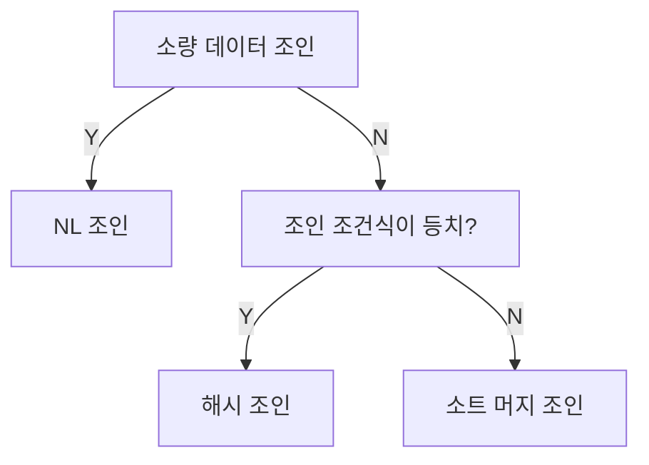

# SQL 조인 튜닝 정리

## 1. NL 조인 (Nested Loops Join)

### 개념
- 소량 데이터 조인에 적합.
- 랜덤 액세스 위주로 동작 → 대량 데이터에는 불리.
- 부분범위 처리가 가능해 OLTP(온라인 트랜잭션) 환경에 적합.

### 실행계획 제어
```sql
select /*+ ordered use_nl(B) use_nl(C) use_hash(D) */ *
from A, B, C, D
where ...
```
- `ordered` : FROM 절 순서대로 조인 (A → B → C → D)
- `use_nl` : NL 조인 강제
- `use_hash` : Hash 조인 강제

```sql
select /*+ leading(C, A, D, B) use_nl(B) use_nl(C) use_hash(D) */ *
from A, B, C, D
where ...
```
- `leading` : 조인 순서를 직접 제어

```sql
select /*+ use_nl(A, B, C, D) */ *
from A, B, C, D
where ...
```
- 옵티마이저가 순서를 결정하도록 맡김

### 예시
```sql
select /*+ ordered use_nl(c) index(e) index(c) */
		e.사원번호, e.사원명, e.입사일자,
		c.고객번호, c.고객명, c.전화번호, c.최종주문금액
from 사원 e, 고객 c
where c.관리사원번호 = e.사원번호
  and e.입사일자 >= '19960101'
  and e.부서코드  = 'Z123'
  and c.최종주문금액 >= 20000
```

### 인덱스 구성
- 사원: **입사일자**, 사원번호
- 고객: **관리사원번호**, 고객번호, 최종주문금액

#### 동작 순서
1. 사원 테이블에서 `입사일자` 조건으로 인덱스 스캔  
2. ROWID로 `부서코드` 확인  
3. 고객 인덱스(관리사원번호) 탐색 후 조인  
4. ROWID로 `최종주문금액` 확인  

#### 튜닝 포인트
- **인덱스 구성 최적화**
  - `입사일자 + 부서코드` 복합 인덱스 고려
  - `최종주문금액`을 인덱스에 포함하여 랜덤 액세스 최소화
- **조인 순서 변경 고려**
  - 필터링 효율이 높은 조건을 앞에 두어 랜덤 액세스 횟수를 줄임
- **고객 인덱스 탐색 횟수 줄이기**  
  - 선행 테이블(사원) 결과 건수를 최소화하는 것이 핵심

---

## 2. 소트 머지 조인 (Sort-Merge Join)

### 개념
- 양쪽 테이블을 **정렬 후 병합**하여 조인.
- 정렬된 결과는 **PGA(프로세스 전용 메모리)**에 저장 → 버퍼캐시/래치 경유 없음.
- 대량 데이터 조인에서 NL보다 유리.

### 특징
- 정렬 비용은 존재하나, 대량 처리 시 효율적.
- Temp 공간 사용 가능 (메모리 부족 시).

---

## 3. 해시 조인 (Hash Join)

### 개념
- **Build → Probe** 두 단계로 수행.
- 작은 집합을 Build Input으로 해시 테이블 생성 후, 큰 집합을 Probe.
- 메모리는 Hash Area(PGA)를 사용 → 래치 경유 없음.

### 실행계획 제어
```sql
select /*+ leading(e) use_hash(c) swap_join_inputs(c) */
		e.사원번호, e.사원명, e.입사일자,
		c.고객번호, c.고객명, c.전화번호, c.최종주문금액
from 사원 e, 고객 c
where c.관리사원번호 = e.사원번호
  and e.입사일자 >= '19960101'
  and e.부서코드  = 'Z123'
  and c.최종주문금액 >= 20000
```

### 대용량 처리
- **파티션 해시 조인**
  - 조인 컬럼에 해시 함수 적용, Temp에 저장 후 파티션별 조인
- **조인 단계 최적화**
  - 파티션별로 Build/Probe를 동적으로 선택

### 조인 선정 기준


### 유의점
- 해시 테이블은 쿼리마다 생성되고 소멸 → **수행 빈도가 낮고 대량 데이터 조인**에 적합.
- 남발 금물.

---

## 4. 서브쿼리 조인

### 서브쿼리 유형
1. **인라인 뷰**: FROM 절 서브쿼리
2. **중첩 서브쿼리**: WHERE 절 조건으로 사용
3. **스칼라 서브쿼리**: 한 레코드당 단일 값 반환

---

### 4.1 인라인 뷰 조인
```sql
select c.고객번호, c.고객명
  from 고객 c,
       (select /*+ merge */ 고객번호, avg(거래금액), ...
          from 거래 
         where 거래일시 >= trunc(sysdate, 'mm')
         group by 고객번호) t
 where c.가입일시 >= trunc(add_months(sysdate, -1), 'mm')
   and t.고객번호 = c.고객번호
```

- 문제점: 인라인 뷰에서 불필요하게 전체 고객번호를 group by.
- 해결: MERGE 또는 **Pushdown** 사용.
  ```sql
  select c.고객번호, c.고객명
    from 고객 c,
         (select /*+ no_merge push_pred */ 고객번호, avg(거래금액)
            from 거래 
           where 거래일시 >= trunc(sysdate, 'mm')
             and t.고객번호 = c.고객번호
           group by 고객번호) t
   where c.가입일시 >= trunc(add_months(sysdate, -1), 'mm')
  ```
- 장점: 전체 집합을 읽지 않고 부분범위 처리 가능.

---

### 4.2 스칼라 서브쿼리 조인
- 특징: 결과가 캐싱됨 → 동일한 입력 값 반복 시 재계산 불필요.
- 장점: 소량 데이터, 카디널리티가 작은 경우 효율적.
- 단점: 다중 컬럼 조회 시 비효율 → 인라인 뷰 + Pushdown 고려.

---

# 결론

- **NL 조인**: 소량 데이터, 부분범위 처리 가능, OLTP에 적합.  
- **소트 머지 조인**: 대량 데이터, 등치가 아닌 조인 조건에도 활용.  
- **해시 조인**: 대량 데이터, 등치 조인 최적. 수행 빈도 낮은 쿼리에 적합.  
- **서브쿼리 조인**: 구조에 따라 성능 차이가 크므로 Pushdown, 캐싱 등을 적극 활용해야 함.  
